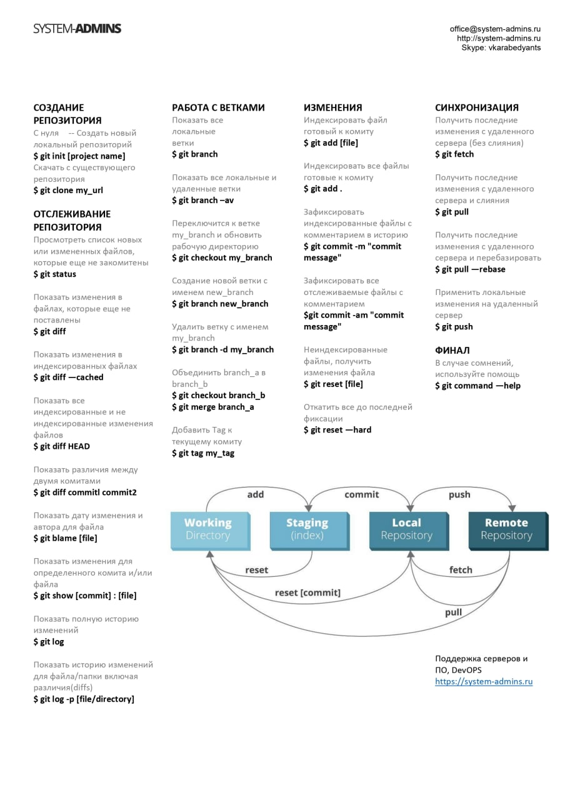

# Инструкция по работе в Git

## 1. Создание репозитория

Для создания репозитория с нуля:
- git init [name file]

Скачать с существующего репозитория:
- git clone my_url

## 2. Отслеживание репозитория

Просмотеть список новых или измененных файлов,которые еще не закомитены:
- git status

Показать изменения в файлах,которые еще не поставлены:
- git diff

Показать изменения в индексированных файлах:
- git diff --cached

Показать все индексированые и не индексированые изменения файлов:
- git diff HEAD

Показатьразличия между двумя комитами:
- git diff commitl commit2

Показать дату изменения и автора для файла:
- git blame [file]

Показать изменения для определенного комита и/или файла:
- git show [commit] : [file]

Показать полную историю изменений:
- git log

Показать исорию изменений для файла/папки включая различия [diffs]:
- git log -p [file/directory]

## 3. Работа с ветками

Показать все локальные ветки:
- git branch

Показать вес локальные и удаленные ветки:
- git branch -av

Переключаться между ветками:
- git checkout [имя ветки]

Создание новой ветки:
- git branch [имя ветки]

Удалить ветку:
- git branch -d [имя ветки]

Для обьединения ветки нужно зайти в одну из веток и ввести команду:
- git merge [имя ветки которую хотим присоединить]

Добавить Tag к текущему комиту:
- git tag my_tag

## 4. Изменения.

Индексировать файл готовый к комиту:
- git add [file]

Индексировать все файлы готовые к комиту:
- git add

Зафиксировать индексированные файлы с комментарием в историю:
- git commit -m "сам комментарий"

Зафиксировать все отслеживаемые файлы с комментарием:
- git commit -am "сам комментарий"

Неиндексированные файлы,получить изменения файла:
- git reset [file]

Откатить все до последней фиксации:
- git reset --hard

## 5.Синхронизация.

Получить последние изменения с удаленного сервера(без слияния):
- git fetch

Получить последние изменения с удаленного сервера и слияния:
- git pull

Получить последние изменения с удаленного сервера и перебазировать:
- git pull --rebase

Применить локальные изменения на удаленный сервер:
- git push

# Синхронизация с GitHub

## Копирование репозитория с GitHub,с чужого аккаунта.

    Заходим на чужой нам аккаунт,находим кнопку FORK и нажимаем ее(т.е. присоединяемся к репозиторию),с помощью этой кнопки мы делаем копию репозитория на свой аккаунт на GitHub
 
## Клонирование удаленного репозитория со своего аккаунта к себе в компьютер. 

    Создаем папку на компьютере(желательно в корне диска,имя только на латинеце).
    заходим к себе в аккаунт на GitHub выбираем вкладку "Code" и копируем ссылку.
    Потом заходим в VS Code открываем созданную нами папку. В терминале ее инициализируем(init), и прописываем команду -"git clone (скопированная ссылка).
    Показываем путь к скаченному репозиторию через команду -cd (и путь к репозиторию). ОБЯЗАТЕЛЬНО создаем новую ветку,и в ней уже работаем.

##      

## 6.Финал.

В случае каких-то сомнений используйте помощь:
- git command --help

## Весь материал списан: 